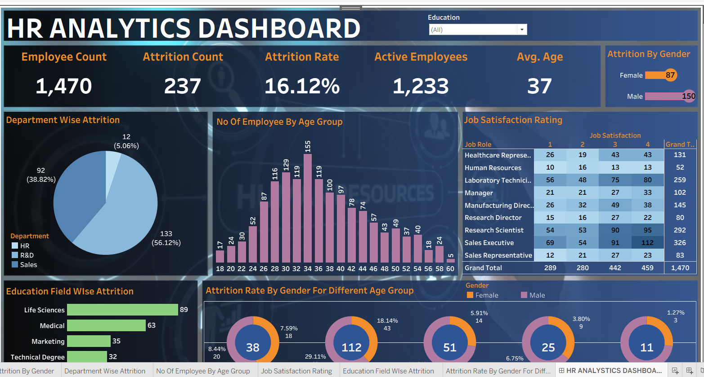

# 📊 HR Analytics Dashboard

## 📌 Project Overview

The **HR Analytics Dashboard** is an interactive data visualization and business intelligence project developed using **Tableau** to analyze employee data and HR performance metrics within an organization.

This project focuses on transforming raw HR data into meaningful insights that help organizations understand workforce trends, employee attrition, job satisfaction, and overall employee performance. The dashboard provides a centralized view of important HR KPIs, enabling HR teams and management to make data-driven decisions effectively.

The dashboard includes detailed analysis of employee attrition, department-wise performance, gender distribution, age group analysis, education field analysis, and job satisfaction ratings through interactive charts and visualizations.

---

# 🎯 Project Objectives

- Analyze employee attrition and workforce trends
- Monitor important HR KPIs in a single dashboard
- Identify departments with high attrition rates
- Understand employee demographics and workforce distribution
- Analyze employee job satisfaction levels
- Build an interactive and user-friendly HR dashboard
- Support data-driven decision-making in HR management

---

# 🛠️ Technologies Used

| Technology | Purpose |
|------------|----------|
| Tableau | Dashboard Development & Data Visualization |
| Excel / CSV | Data Source |
| Data Analytics | HR Data Analysis |
| Business Intelligence | Insight Generation |

---

# 📂 Dashboard Features

## 👨‍💼 Employee Overview
Displays overall workforce statistics including:
- Total Employee Count
- Active Employees
- Average Employee Age

## 📉 Attrition Analysis
Provides detailed attrition insights such as:
- Attrition Count
- Attrition Rate
- Department-Wise Attrition
- Gender-Wise Attrition

## 📊 Workforce Distribution
Analyzes employee distribution based on:
- Age Groups
- Departments
- Gender
- Education Fields

## ⭐ Job Satisfaction Analysis
Visualizes employee satisfaction ratings across different job roles to understand workplace engagement and employee experience.

## 🎛️ Interactive Dashboard
The dashboard contains interactive filters and visualizations that allow users to explore HR data dynamically and gain deeper insights.

---

# 📊 Key Metrics

| KPI | Value |
|-----|------|
| Total Employees | 1,470 |
| Attrition Count | 237 |
| Attrition Rate | 16.12% |
| Active Employees | 1,233 |
| Average Employee Age | 37 |

---

# 📈 Key Insights Generated

The dashboard helps identify:

- Departments with the highest attrition rates
- Workforce distribution across different age groups
- Gender-based attrition patterns
- Education fields contributing to employee attrition
- Employee job satisfaction trends
- Organizational workforce engagement patterns

These insights help organizations improve employee retention strategies, workforce planning, and HR decision-making processes.

---

# 📚 Learning Outcomes

Through this project, practical understanding of the following concepts was achieved:

- HR Analytics
- Data Visualization Techniques
- Tableau Dashboard Development
- KPI Reporting
- Workforce Analysis
- Business Intelligence Concepts
- Data-Driven Decision Making

The project also improved skills in transforming raw HR data into meaningful visual insights and interactive reports.

---

# ✅ Conclusion

The **HR Analytics Dashboard** successfully demonstrates the application of data analytics and visualization techniques in Human Resource Management.

By converting complex HR data into interactive visual reports, the project helps organizations better understand employee behavior, workforce performance, and attrition trends.

This project highlights the importance of business intelligence tools like Tableau in improving organizational decision-making and workforce management.

---

# 📄 Project Documentation

The project includes:
- Interactive Tableau Dashboard
- HR Data Analysis
- KPI Visualizations
- Charts & Graphs
- Workforce Insights
- Attrition Analysis Reports

---

# 📷 Dashboard Preview

---

# 👨‍💻 Author

## Jay Gajare
Computer Engineering Student | Data Analytics & Web Development Enthusiast
